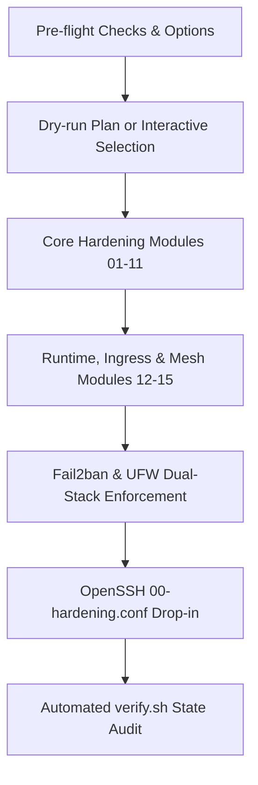

# vps-bootstrap

[](#)
[](#)
[](#)
[](#)

Hardens a fresh Ubuntu 24.04 LTS server in one command. It asks what to apply, shows the full plan,
waits for confirmation, runs every step in a safe order and verifies the result.

Every module is idempotent: a second run changes nothing and says so. The test suite proves it on
each commit.


```
# One-liner execution
curl -fsSL https://raw.githubusercontent.com/jonasnmonteiro/vps-bootstrap/main/install.sh | sudo bash

# Or clone and run locally
git clone https://github.com/jonasnmonteiro/vps-bootstrap.git && cd vps-bootstrap
sudo ./bootstrap.sh --dry-run    # show the plan, change nothing
sudo ./bootstrap.sh              # ask, show the plan, confirm, apply, verify

# Or deploy remotely from your workstation
./bootstrap.sh --remote root@203.0.113.10
```

## Architecture



## Contents

- [What it does](#what-it-does)
- [What it does not do](#what-it-does-not-do)
- [Before you run it](#before-you-run-it)
- [Usage](#usage)
- [Configuration](#configuration)
- [After the run](#after-the-run)
- [Design decisions](#design-decisions)
- [Pitfalls this project guards against](#pitfalls-this-project-guards-against)
- [Testing](#testing)
- [Recovery](#recovery)
- [Project layout](#project-layout)

## What it does

The modules run in the order of their number, whatever order you answered the questions in.

| Module | Result |
|---|---|
| `01-updates` | Package lists refreshed and every pending upgrade applied. Warns when a reboot is required. |
| `02-cloud-account` | Password of the image's default `ubuntu` account locked, unless it is your admin user. |
| `03-admin-user` | Admin user created, added to `sudo`, given the SSH keys of root with correct owner and modes. |
| `04-ssh` | Password and keyboard-interactive login disabled, root limited to keys. Validated before restart. |
| `05-firewall` | UFW denying all incoming traffic except the listed ports, on IPv4 and IPv6. |
| `06-fail2ban` | fail2ban with an `sshd` jail that reads the systemd journal. |
| `07-journald` | Journal kept across reboots, with a fixed size limit. |
| `08-unattended-upgrades` | Security updates installed daily, never followed by an automatic reboot. |
| `09-swap` | Swap file with mode 600, listed in `/etc/fstab`, and `vm.swappiness=10`. |
| `10-time` | Timezone set to UTC and NTP synchronization enabled. |
| `11-hostname` | Hostname set, mapped in `/etc/hosts` and protected from cloud-init on reboot. |
| `12-docker` | Official Docker CE engine, Compose plugin and hardened daemon limits (150M max log retention). |
| `13-caddy` | Caddy reverse proxy with automatic HTTPS and hardened security headers. |
| `14-tailscale` | Tailscale zero-trust mesh VPN daemon and optional unattended node authentication. |
| `15-alerts` | Telegram webhook alerts for fail2ban bans, root logins and pending reboots. |

`checks/verify.sh` checks the final state of all of the above, prints one line per check and exits
non-zero if anything failed. The bootstrap runs it at the end, and you can run it any time.

## What it does not do

These steps happen outside the server, or depend on decisions a script should not make for you:

- Create the SSH keys (they belong on your machine, never on the server).
- Configure the provider's network firewall.
- DNS domain registration.
- Off-site backups.

## Before you run it

Complete this checklist first. The script refuses to disable password login if the admin user has
no valid key, but it cannot check the items that live outside the server.

- [ ] Two factor authentication enabled on the provider account. Whoever controls that account has
      the console, root password resets and reinstalls.
- [ ] A main SSH key and a spare SSH key generated on your machine, each with a passphrase.
- [ ] The main key installed for root on the new server, and a login with it works.
- [ ] The provider's network firewall allows only 22, 80 and 443 in, on IPv4 and IPv6.
- [ ] The root password and every passphrase stored in a password manager.

## Usage

```
sudo ./bootstrap.sh [--auto] [--dry-run] [--only LIST] [--remote HOST] [--list] [--version] [--help]
```

| Command | Effect |
|---|---|
| `sudo ./bootstrap.sh --dry-run` | Prints every command it would run and every change it would make. Changes nothing. Needs root only to read the current state. |
| `sudo ./bootstrap.sh` | Asks whether to apply everything or module by module, shows the plan, asks for confirmation, applies it and runs the checks. |
| `sudo ./bootstrap.sh --auto` | Applies every module without questions. Intended for tests and for machines you can throw away. |
| `sudo ./bootstrap.sh --only ssh,firewall` | Runs only the listed modules, still in their fixed order. |
| `./bootstrap.sh --remote root@<ip>` | Packages and streams the bootstrap directly to a remote host over SSH. |
| `sudo ./checks/verify.sh` | Runs the checks only. |

Without a terminal the script refuses to run unless `--auto` is given, so a pipe can never answer
yes on your behalf.

Every real run is appended to `/var/log/vps-bootstrap.log`, and ends with a list of the changes it
made. When nothing needed to change it prints `No changes needed`.

Keep your current SSH session open during the first run. Open a second terminal and log in again
before you close the first one.

## Configuration

Values come from the environment first and then from a `.env` file next to `bootstrap.sh`. Copy
`.env.example` to `.env` and edit it. The `.env` file is ignored by git, and it is parsed as plain
`KEY=value` lines, never executed.

| Variable | Default | Meaning |
|---|---|---|
| `ADMIN_USER` | the user who ran `sudo` | Admin user to create or use. Asked for when empty and interactive. |
| `SSH_PERMIT_ROOT_LOGIN` | `prohibit-password` | `prohibit-password` keeps root login by key, `no` disables root over SSH. |
| `UFW_ALLOW` | `22/tcp 80/tcp 443/tcp` | Ports open to the world. Must include `22/tcp`. |
| `FAIL2BAN_IGNORE_IP` | `127.0.1.1/8 ::1` | Addresses fail2ban never bans. |
| `FAIL2BAN_BAN_TIME` | `1h` | Ban duration. |
| `FAIL2BAN_MAX_RETRY` | `5` | Failures within 10 minutes before a ban. |
| `JOURNAL_MAX_USE` | `500M` | Disk space the journal may use. |
| `SWAP_SIZE` | `2G` | Size of `/swapfile` when no swap exists. |
| `SWAPPINESS` | `10` | Between 1 and 100. |
| `TIMEZONE` | `UTC` | Any name under `/usr/share/zoneinfo`. |
| `NEW_HOSTNAME` | empty | Hostname to set. Empty keeps the current one. |
| `CLOUD_ACCOUNT` | `ubuntu` | Default account of the cloud image. |
| `TAILSCALE_AUTH_KEY` | empty | Pre-authenticated key for automated Tailscale connection. |
| `TELEGRAM_BOT_TOKEN` | empty | Telegram bot API token for security notifications. |
| `TELEGRAM_CHAT_ID` | empty | Destination Telegram chat or channel ID. |

## After the run

The checks inside the server cannot see what the internet sees. From your machine, with any VPN
off:

```
ssh -o PubkeyAuthentication=no -o IdentitiesOnly=yes <admin>@<ip>   # must say: Permission denied (publickey)
ssh -i ~/.ssh/<spare key> <admin>@<ip>                               # the spare key must work
nc -zv -w 5 <ip> 22                                                  # open
nc -zv -w 5 <ip> 8080                                                # must time out
nc -zv -6 -w 5 <ipv6> 8080                                           # IPv6 as well
```

Then reboot and run `sudo ./checks/verify.sh` again. Only a reboot proves that swap, hostname,
firewall and journal settings persist.

## Design decisions

**Bash, not Ansible.** The script runs on the server right after `git clone`, with nothing to
install first. Ansible is the natural next step for managing several servers from one machine.

**Ask, then plan, then confirm, then run.** Questions and execution are separate steps. Nothing
changes until you approve the complete list, and the list is always in the safe order.

**Stop at the first failure.** If the SSH module fails, enabling the firewall afterwards makes no
sense. Each module runs with `set -euo pipefail` and the bootstrap stops at the first module that
fails.

**A drop-in named `00-hardening.conf` instead of editing `sshd_config`.** OpenSSH uses the first
value it reads, and `sshd_config` includes `sshd_config.d/*.conf` in alphabetical order before its
own body. Cloud images ship `50-cloud-init.conf` with `PasswordAuthentication yes`, which silently
wins over any edit to the main file. A file named `00-` is read first, and cloud-init never rewrites
it.

**Validate the effective configuration, not the file.** The SSH module runs `sshd -t` and then reads
`sshd -T`, the configuration after every include is resolved. If a value is not what the policy
requires, it restores the previous file and does not restart the service.

**`KbdInteractiveAuthentication no` next to `PasswordAuthentication no`.** Otherwise PAM still asks
for a password through keyboard-interactive, and the first setting is decorative.

**`PermitRootLogin prohibit-password` by default.** Root keeps a key based path in, which is a
recovery route that does not depend on the admin user or on sudo. Set `SSH_PERMIT_ROOT_LOGIN=no` if
you prefer to close it.

**Refuse to disable passwords without a working key.** The SSH module aborts if the admin user has
no valid key in `authorized_keys`. A dry run reports the same condition as a warning.

**Allow SSH before enabling UFW.** `ufw enable` with a default deny and no rule for port 22 cuts
the session that ran it. The firewall module also refuses a `UFW_ALLOW` without `22/tcp`.

**`backend = systemd` in fail2ban.** The default backend looks for `/var/log/auth.log`, which may not
exist on current Ubuntu. The jail then starts and looks healthy while reading nothing. Settings live
in `jail.local`, because `jail.conf` is replaced on package upgrades.

**Security updates yes, automatic reboots no.** A reboot at 3 a.m. takes every service and
connection down with it. The server announces pending reboots in `/var/run/reboot-required` and in
the login banner, and `verify.sh` reports it.

**Journal size is configuration, not a command.** `journalctl --vacuum-size` cleans once and the
journal grows again. `SystemMaxUse` in a drop-in is a permanent limit.

**Swap on a server with spare RAM.** Swap turns a memory spike into slowness instead of a process
killed by the OOM killer. `vm.swappiness=10` means swap under real pressure only. Zero is rejected
because it makes the OOM killer act earlier, not later. The swap file is mode 600 because it holds
memory pages, keys included.

**UTC.** Timezones with daylight saving repeat one hour a year, which makes logs ambiguous exactly
when you need them. Converting times is the job of the application.

**`preserve_hostname: true`.** Otherwise cloud-init restores the provider's hostname on the next
boot.

**No secrets in the repository.** Everything specific to one server comes from `.env`, which is
ignored by git. `.env.example` documents the variables without real values.

**No comments in the code.** Names carry the intent and this README carries the reasons. The CI
style check enforces it.

## Pitfalls this project guards against

| Pitfall | Symptom | Where it is handled |
|---|---|---|
| `50-cloud-init.conf` wins over `sshd_config` | Password login still works after you disabled it | `04-ssh`, drop-in `00-` and `sshd -T` check |
| `KbdInteractiveAuthentication yes` | PAM still asks for a password | `04-ssh` |
| Invalid sshd configuration | sshd does not start and nobody gets in | `04-ssh` runs `sshd -t` and rolls back |
| `authorized_keys` owned by root after a copy | `StrictModes` ignores the key silently | `03-admin-user` sets owner and modes |
| `usermod -G` without `-a` | The user loses every other group | `03-admin-user` uses `-aG` |
| Cloud account with a password and `NOPASSWD` sudo | Brute force leads to root | `02-cloud-account` |
| `ufw enable` before allowing port 22 | You lock yourself out | `05-firewall` orders the steps and requires `22/tcp` |
| Rules for IPv4 only | Ports stay open over IPv6 | `05-firewall` forces `IPV6=yes`, `verify.sh` checks both |
| Editing `jail.conf` | Changes disappear on upgrade | `06-fail2ban` writes `jail.local` |
| fail2ban `backend = auto` | The jail watches nothing | `06-fail2ban` |
| Volatile journal | Logs vanish on every reboot | `07-journald` |
| `--vacuum-size` used as a limit | The journal grows again | `07-journald` |
| `Automatic-Reboot "true"` | The server reboots by itself at night | `08-unattended-upgrades` |
| Old kernels fill `/boot` | `apt` stops with an unrelated error | `08-unattended-upgrades` removes unused kernels |
| Swap file readable by everyone | Memory contents exposed | `09-swap` enforces mode 600 |
| `tee` without `-a` on `/etc/fstab` | The server does not boot | `09-swap` appends and runs `findmnt --verify` |
| `vm.swappiness=0` | Earlier OOM kills | `09-swap` rejects it |
| cloud-init restores the hostname | The old name returns after a reboot | `11-hostname` |
| No `127.0.1.1` line in `/etc/hosts` | Every `sudo` hangs for seconds | `11-hostname` |
| Unbounded container log growth | Docker fills up the root disk partition | `12-docker` caps logs at 150MB |
| Direct exposure of application ports | Unencrypted traffic and weak cipher suites | `13-caddy` enforces automatic TLS |
| Public SSH exposed to port scanning | Excessive noise and brute force attempts | `14-tailscale` allows zero-trust isolation |
| Silent intrusion attempts | Admins unaware of attacks or ban events | `15-alerts` dispatches instant Telegram alerts |
| A non-interactive pipe answers the prompts | Changes you never approved | `bootstrap.sh` requires `--auto` without a terminal |

## Testing

Tests run in layers, from cheap to realistic. Details and macOS instructions are in
[docs/testing.md](docs/testing.md).

| Command | Where | What it proves |
|---|---|---|
| `make lint` | Anywhere with ShellCheck | No classic shell mistakes |
| `make check-style` | Anywhere with Perl | No comments, em dashes or emojis |
| `make record-demo` | Anywhere with VHS | Generates animated terminal GIF in docs/demo.gif |
| `make test-container` | Docker | Full run in a systemd container that mimics a cloud image, a no-op second run and real SSH logins |
| `make test-vm` | Multipass | Everything above plus swap, NTP, a reboot and checks from outside the VM |

CI runs lint, style and the container test on every push.

## Recovery

- **The key is refused.** Run `ssh -v` and check which key is offered. Check owner and mode of
  `~/.ssh` (700) and `authorized_keys` (600). Try another network in case fail2ban banned you.
- **Still locked out.** Use the provider's web console, which does not go through SSH. This is why
  the root password stays in your password manager.
- **Before pressing "Reset" in a provider panel,** read what it does. On some providers it reinstalls
  the whole system.

## Project layout

```
bootstrap.sh              questions, plan, confirmation, execution, summary, remote deploy
install.sh                one-liner curl pipe installer with tty recovery
lib/common.sh             logging, dry-run wrapper, file sync, apt helpers
modules/NN-name.sh        one concern per file, run in numeric order (01 to 15)
configs/                  versioned configuration files, with @PLACEHOLDERS@ for settings
checks/verify.sh          final state checks
tests/container.sh        systemd container test
tests/multipass.sh        VM test with reboot
tests/style.sh            no comments, dashes or emojis
tests/fixtures/           simulated cloud image defaults
tests/container/          test image
docs/demo.tape            VHS terminal recording specification
docs/demo.gif             animated terminal showcase
.github/workflows/ci.yml  lint, style and container test
```
